# 🎙️ GradReady Interview App
[](https://flutter.dev)
[](https://cloud.google.com)
[](https://makersuite.google.com)

An AI-powered mobile app built with Flutter that lets users practice interview questions and live presentations using real-time voice transcription and AI-generated feedback.

## 🚀 Features
- 🎤 Real-time voice recording and transcription
- 🤖 Intelligent AI feedback on:
  - Clarity of speech
  - Tone and delivery
  - Use of filler words
  - Overall presentation quality
- 📋 Dynamic question generation based on job roles
- 🧠 Presentation mode with topic-based feedback
- 🔄 Continuous practice mode

## 📱 Platforms Supported
- 📱 Android
- 🍏 iOS
- 🖥 Web
- 🐧 Linux
- 🍎 macOS
- 🪟 Windows

## 🛠 Requirements
- Flutter SDK 3.7+
- Android Studio / VS Code
- Google API service account (for Speech-to-Text)
- Gemini API key from Google Ai Studio

## 📁 Setup Instructions

### 1. Clone the Repository
```bash
git clone https://github.com/rikue29/grad_ready.git
cd grad_ready
```

### 2. Firebase Setup

1. Go to [Firebase Console](https://console.firebase.google.com)
2. Create a new project or select an existing one
3. Add your app to the Firebase project:
   - For Android: Register your app with your package name
   - For iOS: Register your app with your bundle ID
4. Download the configuration file:
   - For Android: `google-services.json`
   - For iOS: `GoogleService-Info.plist`

#### Android Setup
1. Place `google-services.json` in the `android/app` directory
2. Add the following to your `android/build.gradle`:
   ```gradle
   dependencies {
       classpath 'com.google.gms:google-services:4.4.0'
   }
   ```
3. Add this to your `android/app/build.gradle`:
   ```gradle
   apply plugin: 'com.google.gms.google-services'
   ```

#### iOS Setup
1. Place `GoogleService-Info.plist` in the `ios/Runner` directory
2. Add the following to your `ios/Podfile`:
   ```ruby
   pod 'Firebase/Core'
   ```
3. Run `pod install` in the `ios` directory

For more detailed setup instructions, refer to the [Firebase Flutter documentation](https://firebase.google.com/docs/flutter/setup).

### 3. API Setup

#### 🔐 Gemini API (Google Ai Studio)
1. Go to [Google Ai Studio](https://aistudio.google.com)
2. Create a new project or select an existing one
3. Click on the "Settings" icon (⚙️) in the top right corner
4. Navigate to the "API" tab
5. Click "Get API Key"
6. Copy the API key and add it to your `.env` file:
   ```env
   GEMINI_API_KEY=your_gemini_api_key_here
   ```

#### 🗣 Google Speech-to-Text Setup

1. Go to [Google Cloud Console](https://console.cloud.google.com)
2. Create a new project or select an existing one
3. Enable the following APIs:
   - Speech-to-Text API
   - Cloud Translation API (if needed)

##### Create Service Account
1. Navigate to IAM & Admin > Service Accounts
2. Click "Create Service Account"
3. Fill in the details:
   - Service account name: `gradready-speech`
   - Service account ID: `gradready-speech`
   - Description: `Service account for GradReady Speech-to-Text`
4. Click "Create and Continue"
5. Grant the following roles:
   - Speech-to-Text API User
   - Storage Object Viewer
6. Click "Continue" then "Done"

##### Create Service Account Key
1. Find your service account in the list
2. Click the three dots (⋮) on the right
3. Select "Manage keys"
4. Click "Add key" > "Create new key"
5. Select JSON format
6. Click "Create"
7. Save the JSON file as `service-account.json` in your project's `assets` directory

##### Configure Flutter Project
1. Add the service account file to your Flutter project:
   - Place `service-account.json` in `assets/` directory
2. Update `pubspec.yaml` to include the service account file:
   ```yaml
   flutter:
     assets:
       - assets/service-account.json
   ```

For more detailed setup instructions, refer to the official documentation:
- [Speech-to-Text API Documentation](https://cloud.google.com/speech-to-text/docs)
- [Google Ai Studio API Documentation](https://ai.google.dev/gemini-api/docs)

### 4. Environment Setup
Create a `.env` file in the project root with your API keys:
```env
GEMINI_API_KEY=your_gemini_api_key_here
```

### 5. Install Dependencies
```bash
flutter pub get
```

### 6. Run the App
```bash
flutter run
```

## 🧪 Troubleshooting

### Voice Input Issues
If the app doesn't pick up your microphone:
- On Android emulator: Enable mic input in extended controls
- Use a real Android phone for best results

## 📸 Screenshots

<div align="center">
  <h3>App Overview</h3>
  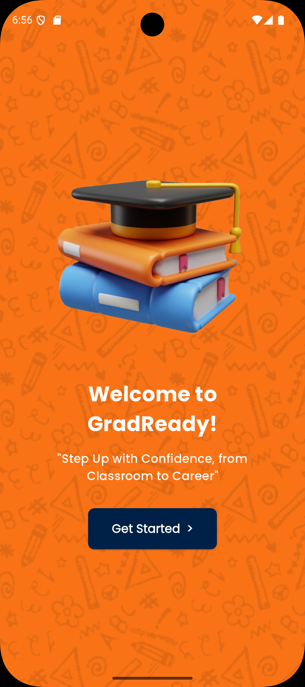
  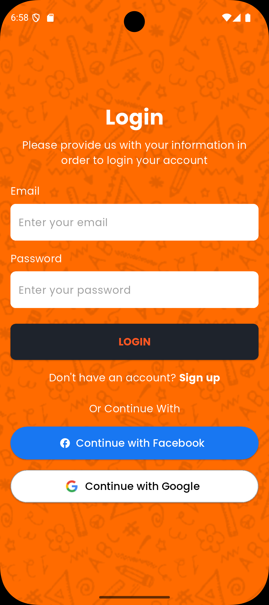
  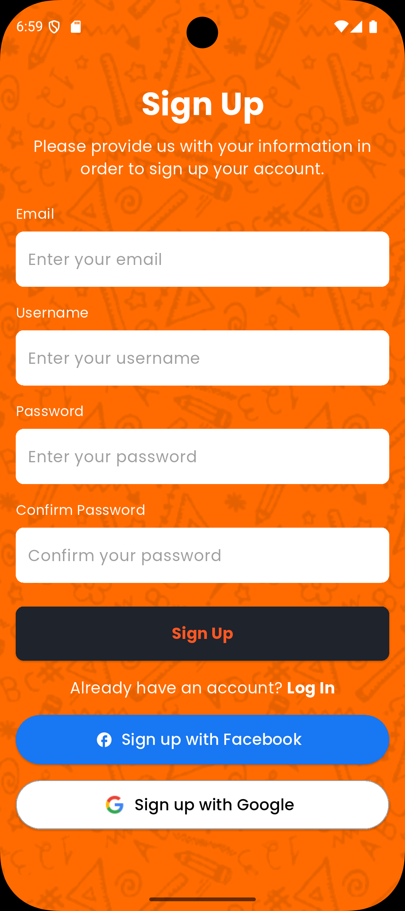
</div>

<div align="center">
  <h3>Main Screen</h3>
  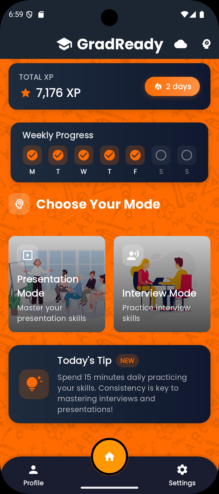
  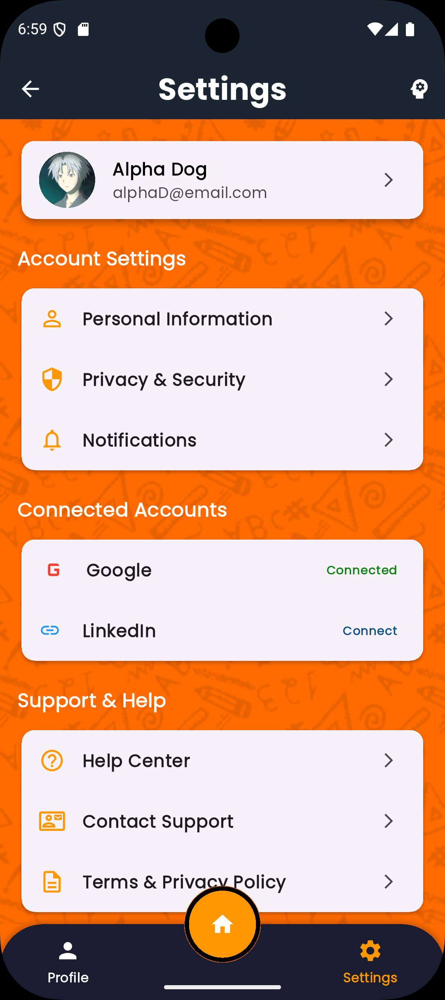
  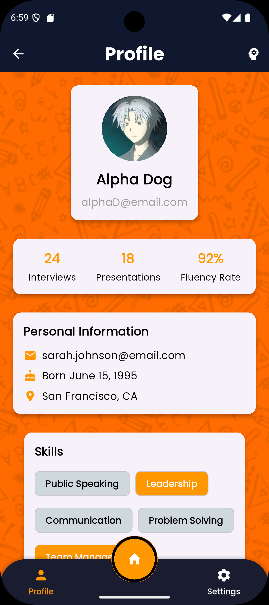
</div>

<div align="center">
  <h3>Interview Features</h3>
  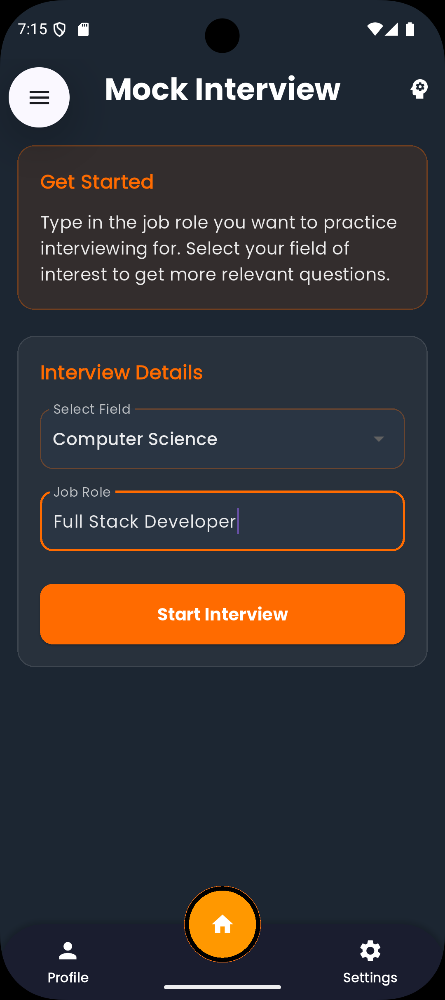
  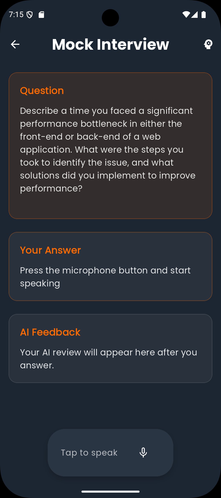
  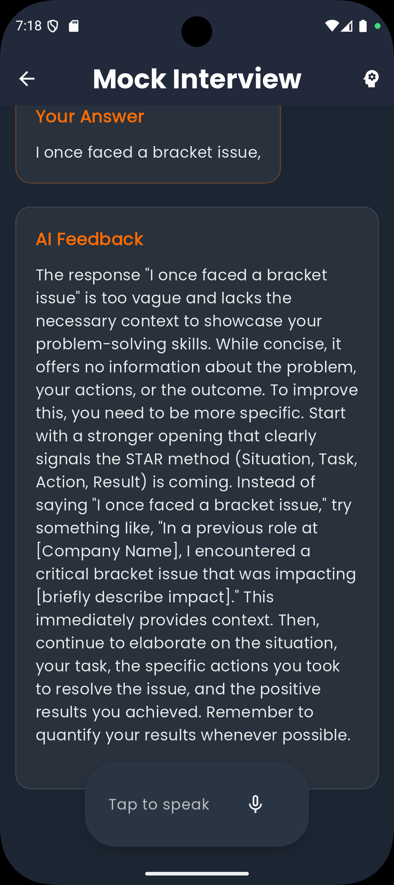
</div>

<div align="center">
  <h3>Live Presentation Features</h3>
  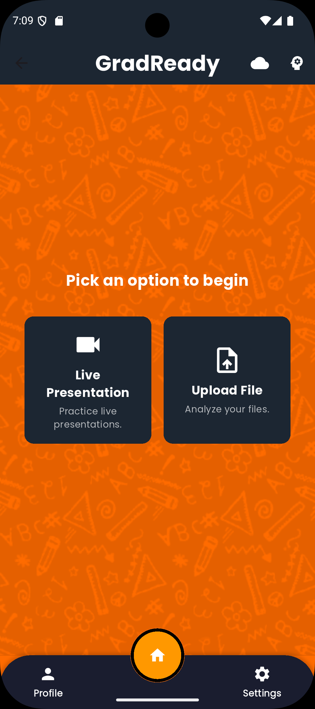
  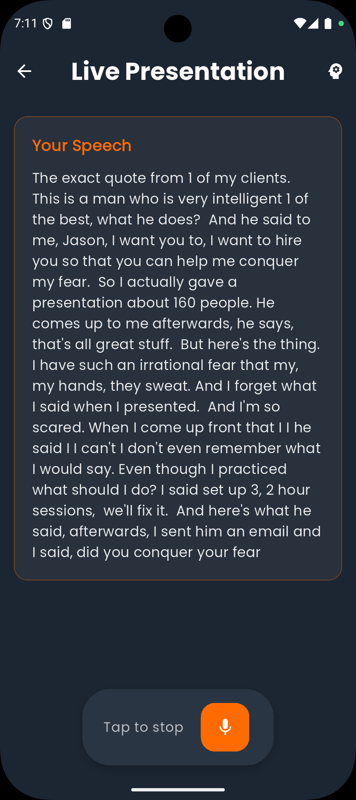
  <div style="display: flex; justify-content: center; gap: 16px;">
    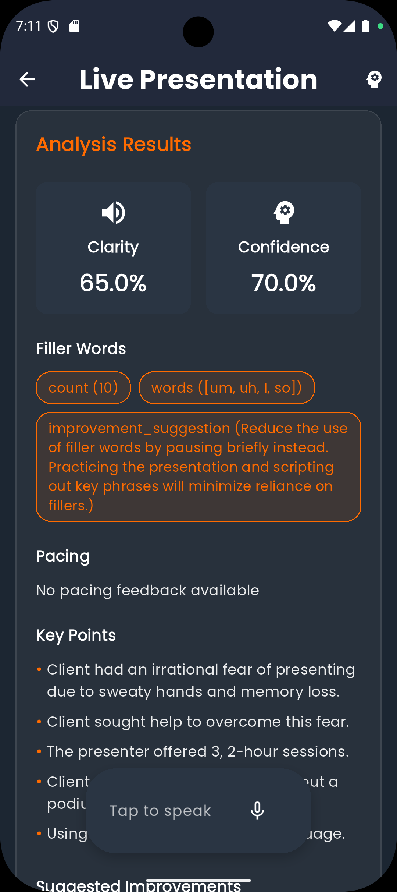
    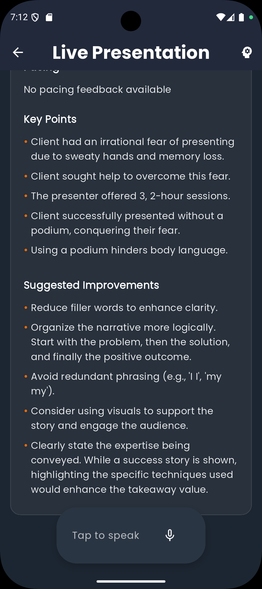
  </div>
</div>

<div align="center">
  <h3>Upload Audio Analysis</h3>
  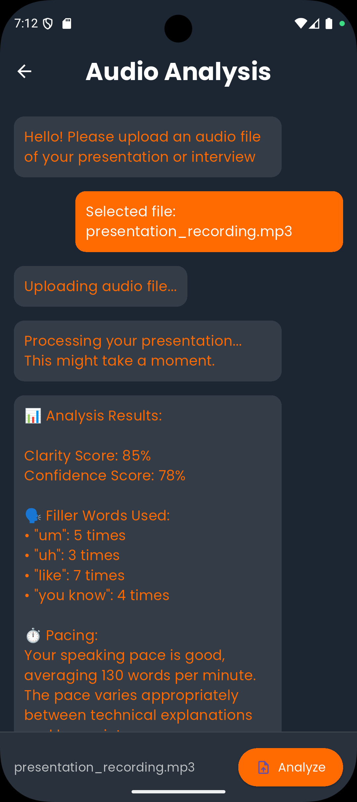
</div>

## 🧑‍💻 Contributors
- Ariq Ulwan
- Nur Akmal
- Nurin Adni
- Shane Kennedy

Special thanks to KitaHack for the opportunity

## 📄 License
This project is open source and available under the MIT License.

## 📬 Feedback & Support
For any questions, feedback, or support, please open an issue in the repository.

## 🌟 Star the Project
If you find this project useful, please give it a star ⭐ on GitHub!
